# DOCUMENT TONG HOP - Web Booking Tour Viet Nam
# MyTour - He thong dat tour du lich truc tuyen

---

## MUC LUC

1. [Tong quan he thong](#1-tong-quan-he-thong)
2. [Kien truc he thong](#2-kien-truc-he-thong)
3. [Flow nghiep vu toan bo](#3-flow-nghiep-vu-toan-bo)
4. [Tinh nang hien tai](#4-tinh-nang-hien-tai)
5. [Tinh nang CON THIEU - Can phat trien](#5-tinh-nang-con-thieu)
6. [Cai thien UI/UX](#6-cai-thien-uiux)
7. [Huong dan Docker](#7-huong-dan-docker)
8. [CI/CD - Tu dong deploy mien phi](#8-cicd-tu-dong-deploy-mien-phi)

---

## 1. TONG QUAN HE THONG

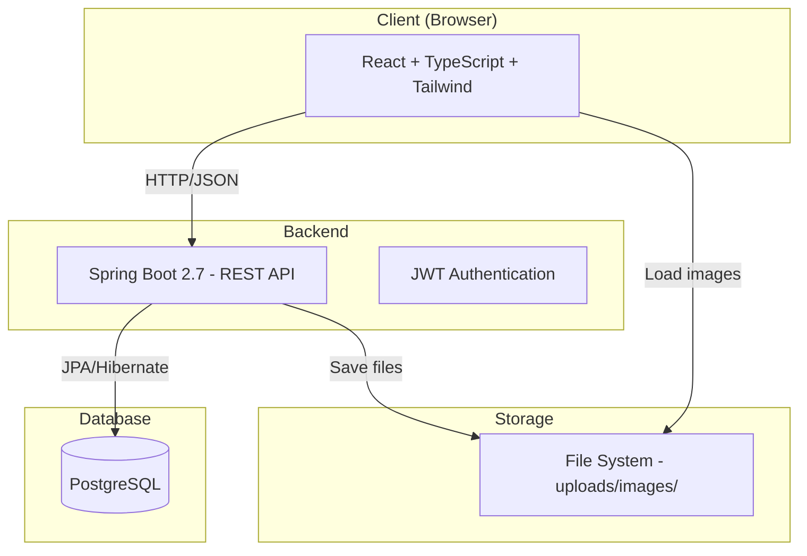

### Tech Stack

| Layer | Technology |
|-------|-----------|
| Frontend | React 18, TypeScript, Tailwind CSS, Vite |
| Backend | Spring Boot 2.7, Spring Security, JPA |
| Database | PostgreSQL 12 |
| Auth | JWT (7 ngay) |
| File Storage | Local filesystem |
| Containerize | Docker + Docker Compose |

---

## 2. KIEN TRUC HE THONG

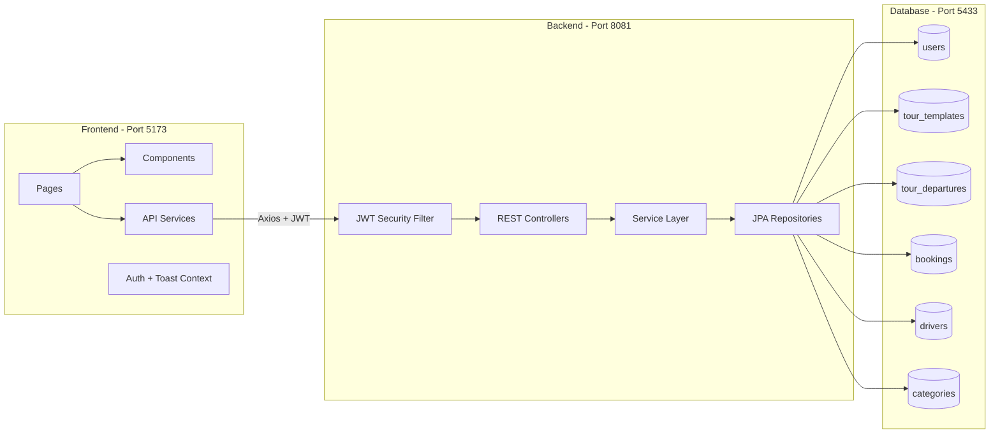

### Database Schema (ERD)

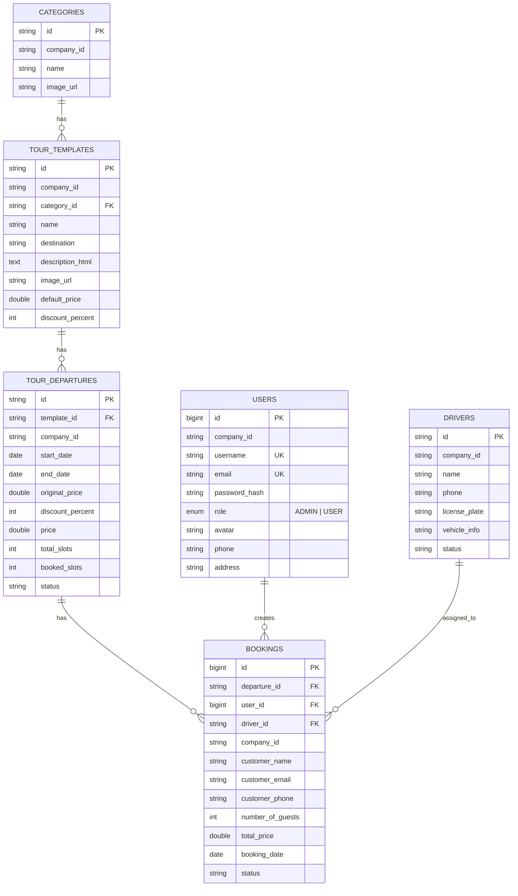

---

## 3. FLOW NGHIEP VU TOAN BO

### 3.1 Flow tong the 3 Role

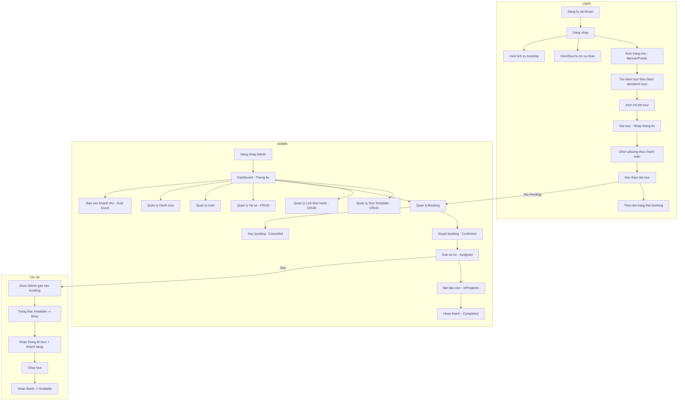

### 3.2 Flow Booking chi tiet

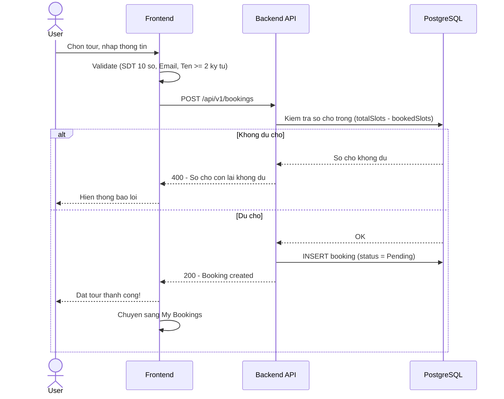

### 3.3 Flow Trang thai Booking (State Machine)

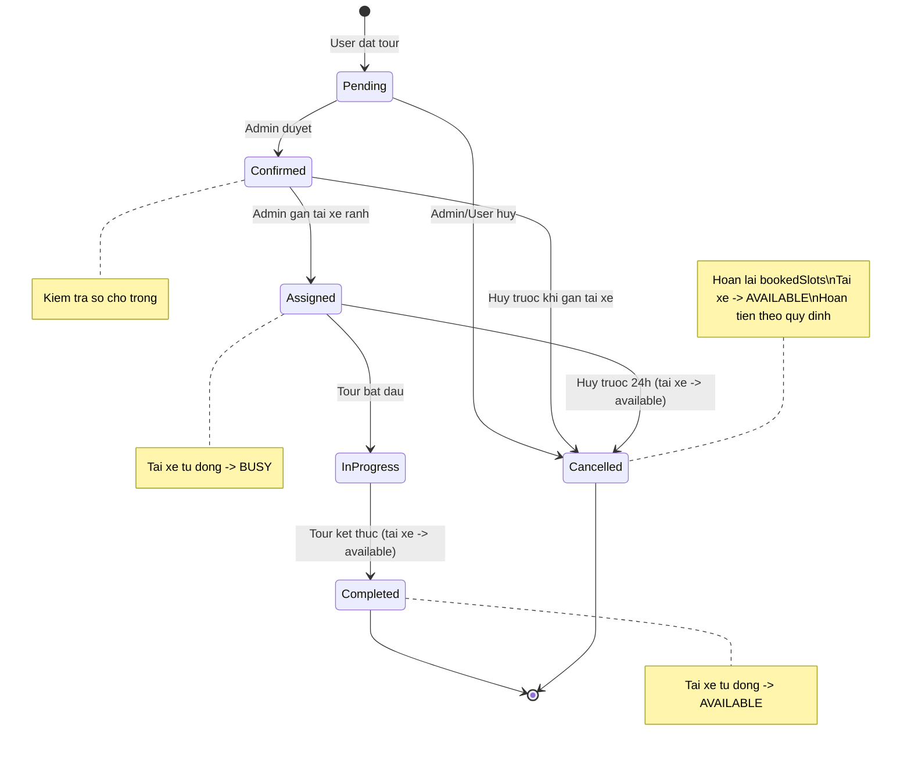

### 3.4 Flow Huy Tour - Chinh sach hoan tien

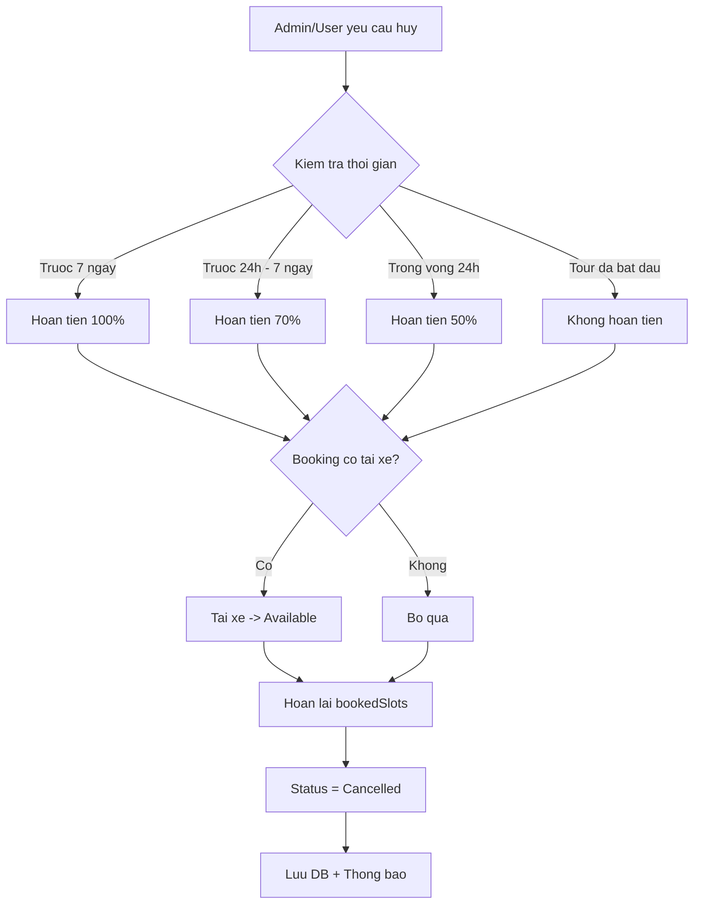

### 3.5 Flow Tai xe

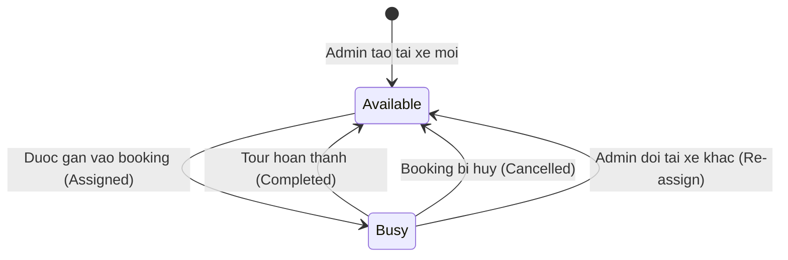

### 3.6 Flow Dang nhap & Phan quyen

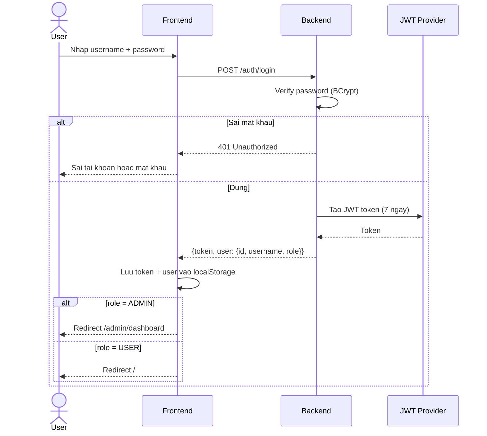

---

## 4. TINH NANG HIEN TAI (Da co)

### Frontend
- [x] Trang chu voi Banner Slider (Slick)
- [x] Tim kiem tour theo diem den, danh muc, gia
- [x] Chi tiet tour voi Rich Text
- [x] Dat tour voi form validation
- [x] My Bookings - xem lich su
- [x] Profile - cap nhat thong tin, doi mat khau
- [x] Admin Dashboard
- [x] CRUD Tour Template (voi Rich Text Editor)
- [x] CRUD Lich khoi hanh
- [x] Quan ly Booking voi StatusBadge mau sac
- [x] Quan ly Tai xe (bien so, thong tin xe)
- [x] Quan ly User
- [x] Quan ly Danh muc
- [x] Bao cao Doanh thu + Xuat Excel
- [x] SearchableComboBox chon tai xe
- [x] Nut Zalo + Hotline noi
- [x] Font Be Vietnam Pro cho tieng Viet
- [x] Responsive mobile

### Backend
- [x] JWT Authentication
- [x] CRUD APIs cho tat ca entity
- [x] Booking status flow (Pending -> Completed)
- [x] Tu dong cap nhat trang thai tai xe
- [x] Kiem tra so cho trong khi dat tour
- [x] Upload file anh
- [x] Bao cao doanh thu theo thang

---

## 5. TINH NANG CON THIEU - Can phat trien

### 5.1 Thong bao Real-time (WebSocket) - CHUA CO

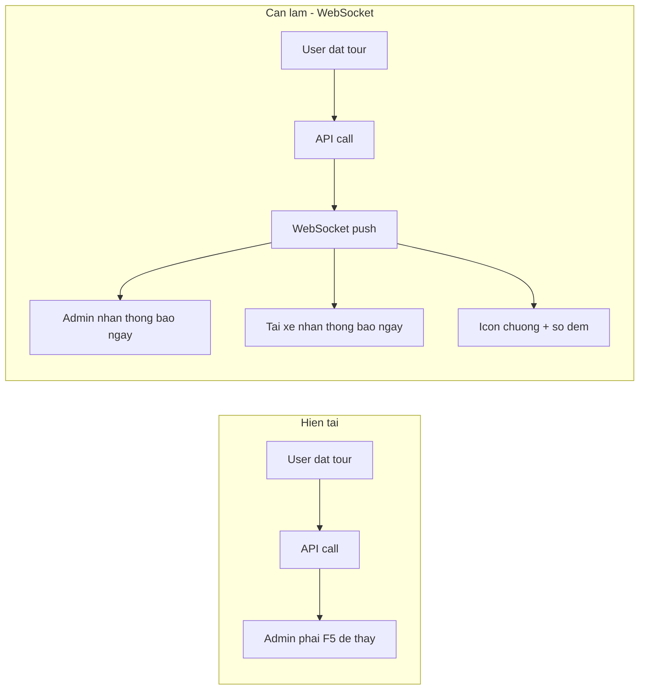

**Can lam:**
- BE: Them Spring WebSocket + STOMP
- FE: Them SockJS client
- Khi co booking moi -> push notification den Admin
- Khi gan tai xe -> push notification den Tai xe
- Icon chuong o Header voi so dem (badge do)

### 5.2 Gui Email tu dong - CHUA CO

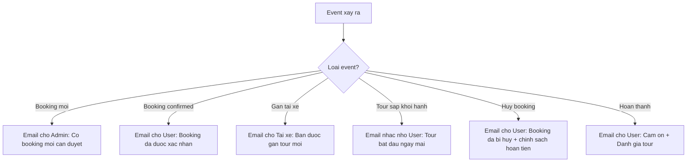

**Can lam:**
- BE: Them Spring Mail + template email HTML
- Config SMTP (Gmail/SendGrid mien phi)
- Gui email tu dong khi thay doi trang thai booking

### 5.3 Hoa don (Invoice) khi Booking thanh cong - CHUA CO

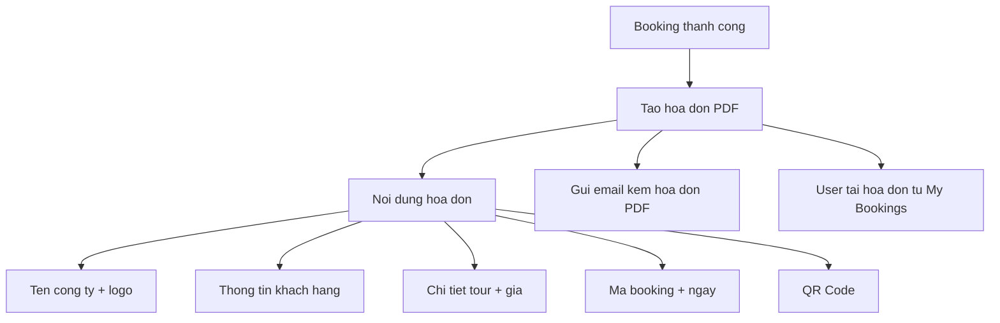

**Can lam:**
- BE: Dung iText/OpenPDF de tao PDF
- FE: Nut "Tai hoa don" trong My Bookings
- Template hoa don tieng Viet

### 5.4 Danh gia & Binh luan (Review) - CHUA CO

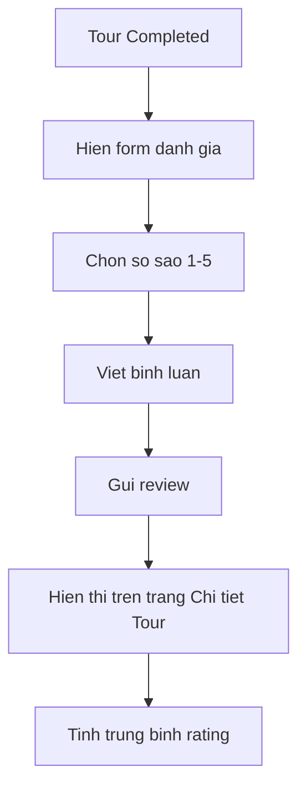

**Can lam:**
- DB: Bang `reviews` (user_id, tour_id, rating, comment)
- FE: Component Star Rating + Comment form
- Hien thi reviews tren TourDetailPage

### 5.5 Thanh toan Online - CHUA CO

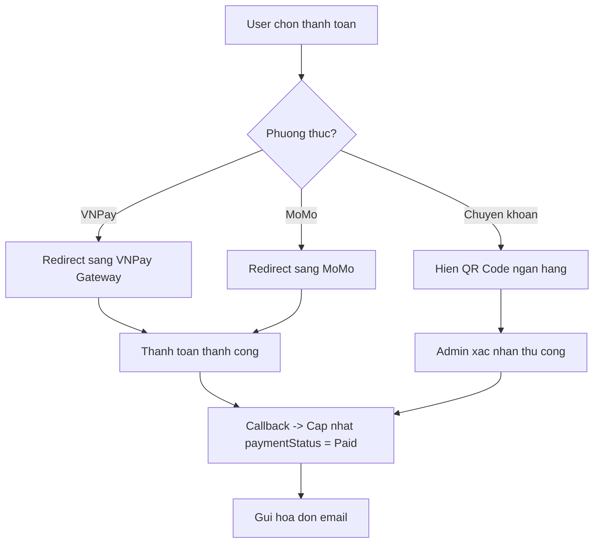

### 5.6 Role TAI XE - Trang rieng - CHUA CO

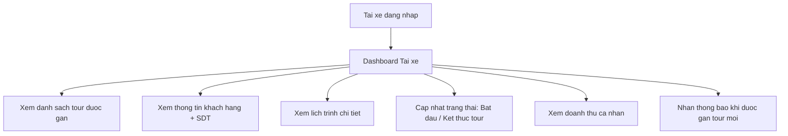

### 5.7 Bang tong hop tinh nang con thieu

| # | Tinh nang | Do kho | Uu tien | Thoi gian uoc tinh |
|---|-----------|--------|---------|---------------------|
| 1 | WebSocket Notification | Trung binh | CAO | 2-3 ngay |
| 2 | Gui Email tu dong | De | CAO | 1-2 ngay |
| 3 | Hoa don PDF | Trung binh | CAO | 2 ngay |
| 4 | Review & Rating | De | TRUNG BINH | 2 ngay |
| 5 | Thanh toan VNPay/MoMo | Kho | TRUNG BINH | 3-5 ngay |
| 6 | Trang rieng Tai xe | Trung binh | CAO | 3 ngay |
| 7 | Thong ke nang cao (bieu do) | De | THAP | 1 ngay |
| 8 | Multi-language (EN/VI) | De | THAP | 2 ngay |
| 9 | PWA + Push Notification | Trung binh | THAP | 2 ngay |
| 10 | Chat truc tuyen | Kho | THAP | 3-5 ngay |

---

## 6. CAI THIEN UI/UX

### 6.1 Nhung diem can cai thien

| Trang | Van de | Giai phap |
|-------|--------|-----------|
| TourDetailPage | Chua co gallery anh nhieu | Them Lightbox gallery voi nhieu anh |
| BookingPage | Chua co step wizard ro rang | Lam 3 buoc: Thong tin -> Thanh toan -> Xac nhan |
| MyBookingsPage | Chi co danh sach don gian | Them timeline trang thai, nut huy tour |
| Admin Dashboard | Chi co so lieu co ban | Them bieu do Chart.js (doanh thu, booking theo thang) |
| Mobile | Sidebar filter bi che | Cai thien bottom sheet filter |
| Header | Khong co notification bell | Them icon chuong + badge |
| Footer | Thieu ban do Google Maps | Them embedded map |
| LoginPage | Khong co "Quen mat khau" | Them flow reset password qua email |
| All pages | Khong co loading skeleton deu | Them skeleton cho moi trang |
| Tour card | Thieu so luong cho con lai | Hien "Con X cho" tren card |

### 6.2 Wireframe cai thien Header

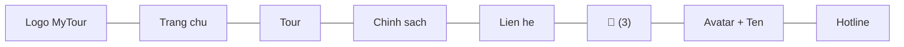

---

## 7. HUONG DAN DOCKER

### 7.1 Docker Compose (chay toan bo he thong)

Tao file `docker-compose.yml` o thu muc goc:

```yaml
version: '3.8'

services:
  # === DATABASE ===
  postgres:
    image: postgres:12-alpine
    container_name: mytour_db
    environment:
      POSTGRES_DB: mytour_db
      POSTGRES_USER: user
      POSTGRES_PASSWORD: password
    ports:
      - "5433:5432"
    volumes:
      - pgdata:/var/lib/postgresql/data
    restart: unless-stopped

  # === BACKEND ===
  backend:
    build:
      context: ./travel-be
      dockerfile: Dockerfile
    container_name: mytour_be
    ports:
      - "8081:8081"
    environment:
      SPRING_DATASOURCE_URL: jdbc:postgresql://postgres:5432/mytour_db
      SPRING_DATASOURCE_USERNAME: user
      SPRING_DATASOURCE_PASSWORD: password
    depends_on:
      - postgres
    volumes:
      - uploads:/app/uploads
    restart: unless-stopped

  # === FRONTEND ===
  frontend:
    build:
      context: ./travel-web
      dockerfile: Dockerfile
    container_name: mytour_fe
    ports:
      - "80:80"
    depends_on:
      - backend
    restart: unless-stopped

volumes:
  pgdata:
  uploads:
```

### 7.2 Dockerfile cho Backend

Tao file `travel-be/Dockerfile`:

```dockerfile
FROM maven:3.8-openjdk-8-slim AS build
WORKDIR /app
COPY pom.xml .
RUN mvn dependency:go-offline -B
COPY src ./src
RUN mvn package -DskipTests -B

FROM openjdk:8-jre-slim
WORKDIR /app
COPY --from=build /app/target/*.jar app.jar
RUN mkdir -p uploads/images
EXPOSE 8081
ENTRYPOINT ["java", "-jar", "app.jar"]
```

### 7.3 Dockerfile cho Frontend

Tao file `travel-web/Dockerfile`:

```dockerfile
FROM node:18-alpine AS build
WORKDIR /app
COPY package*.json ./
RUN npm ci
COPY . .
RUN npm run build

FROM nginx:alpine
COPY --from=build /app/dist /usr/share/nginx/html
COPY nginx.conf /etc/nginx/conf.d/default.conf
EXPOSE 80
CMD ["nginx", "-g", "daemon off;"]
```

### 7.4 Nginx config cho Frontend

Tao file `travel-web/nginx.conf`:

```nginx
server {
    listen 80;
    server_name localhost;
    root /usr/share/nginx/html;
    index index.html;

    # React Router - moi route deu tra ve index.html
    location / {
        try_files $uri $uri/ /index.html;
    }

    # Proxy API calls den Backend
    location /api/ {
        proxy_pass http://backend:8081;
        proxy_set_header Host $host;
        proxy_set_header X-Real-IP $remote_addr;
    }

    # Proxy upload files
    location /uploads/ {
        proxy_pass http://backend:8081;
    }
}
```

### 7.5 Lenh chay

```bash
# Build va chay toan bo
docker-compose up --build -d

# Xem logs
docker-compose logs -f

# Dung
docker-compose down

# Dung + xoa data
docker-compose down -v
```

---

## 8. CI/CD - TU DONG DEPLOY MIEN PHI

### 8.1 Tong quan

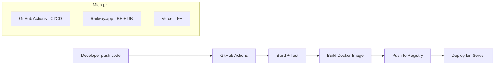

### 8.2 Phuong an MIEN PHI de demo

| Service | Dung cho | Free tier |
|---------|---------|-----------|
| **Vercel** | Frontend React | Unlimited |
| **Railway.app** | Backend Spring Boot + PostgreSQL | $5 credit/thang (du demo) |
| **GitHub Actions** | CI/CD pipeline | 2000 phut/thang |
| **Neon.tech** | PostgreSQL (thay the) | 512MB free |

### 8.3 Deploy Frontend len Vercel (MIEN PHI)

```bash
# 1. Cai Vercel CLI
npm i -g vercel

# 2. Login
vercel login

# 3. Deploy
cd travel-web
vercel --prod
```

Hoac ket noi GitHub repo -> Vercel dashboard -> Auto deploy khi push.

Cau hinh Environment Variables tren Vercel:
```
VITE_API_URL=https://your-be.railway.app
```

### 8.4 Deploy Backend len Railway (MIEN PHI)

```bash
# 1. Cai Railway CLI
npm i -g @railway/cli

# 2. Login
railway login

# 3. Init project
cd travel-be
railway init

# 4. Them PostgreSQL
railway add --plugin postgresql

# 5. Deploy
railway up
```

Railway tu dong detect Spring Boot va build.

### 8.5 GitHub Actions - CI/CD Pipeline

Tao file `.github/workflows/deploy.yml`:

```yaml
name: CI/CD Pipeline

on:
  push:
    branches: [main]

jobs:
  # === BUILD & TEST BACKEND ===
  backend:
    runs-on: ubuntu-latest
    steps:
      - uses: actions/checkout@v4

      - name: Set up JDK 8
        uses: actions/setup-java@v4
        with:
          java-version: '8'
          distribution: 'temurin'

      - name: Build Backend
        run: |
          cd travel-be
          ./mvnw clean package -DskipTests -B

      - name: Deploy to Railway
        if: success()
        run: |
          npm i -g @railway/cli
          cd travel-be
          railway up --service backend
        env:
          RAILWAY_TOKEN: ${{ secrets.RAILWAY_TOKEN }}

  # === BUILD & DEPLOY FRONTEND ===
  frontend:
    runs-on: ubuntu-latest
    steps:
      - uses: actions/checkout@v4

      - name: Setup Node.js
        uses: actions/setup-node@v4
        with:
          node-version: '18'

      - name: Install & Build
        run: |
          cd travel-web
          npm ci
          npm run build

      - name: Deploy to Vercel
        if: success()
        run: |
          npm i -g vercel
          cd travel-web
          vercel --prod --token=${{ secrets.VERCEL_TOKEN }}
        env:
          VERCEL_ORG_ID: ${{ secrets.VERCEL_ORG_ID }}
          VERCEL_PROJECT_ID: ${{ secrets.VERCEL_PROJECT_ID }}
```

### 8.6 Huong dan tung buoc

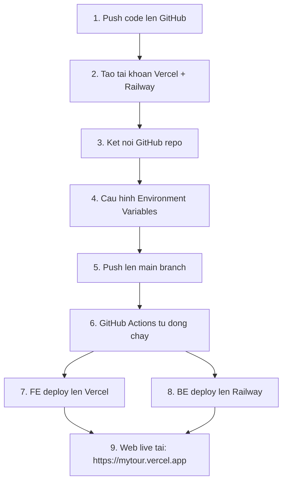

### Buoc chi tiet:

**Buoc 1: Tao GitHub repo**
```bash
cd C:/hoang
git init
git add travel-web travel-be
git commit -m "Initial commit"
git remote add origin https://github.com/YOUR_USERNAME/mytour.git
git push -u origin main
```

**Buoc 2: Dang ky Vercel (FE)**
- Vao https://vercel.com -> Sign up bang GitHub
- Import repo -> Chon folder `travel-web`
- Framework: Vite
- Build command: `npm run build`
- Output: `dist`

**Buoc 3: Dang ky Railway (BE + DB)**
- Vao https://railway.app -> Sign up bang GitHub
- New Project -> Deploy from GitHub
- Chon folder `travel-be`
- Add Plugin -> PostgreSQL
- Set Environment Variables:
  ```
  SPRING_DATASOURCE_URL=jdbc:postgresql://${{Postgres.PGHOST}}:${{Postgres.PGPORT}}/${{Postgres.PGDATABASE}}
  SPRING_DATASOURCE_USERNAME=${{Postgres.PGUSER}}
  SPRING_DATASOURCE_PASSWORD=${{Postgres.PGPASSWORD}}
  ```

**Buoc 4: Cap nhat FE de goi API moi**
- Tao file `travel-web/.env.production`:
  ```
  VITE_API_URL=https://your-be.railway.app
  ```
- Cap nhat `apiClient.ts` de dung env variable

**Buoc 5: Moi lan push code -> tu dong deploy!**

---

## 9. BANG TONG HOP PHAN QUYEN

| Chuc nang | User | Admin | Tai xe (tuong lai) |
|-----------|:----:|:-----:|:------------------:|
| Dang ky / Dang nhap | V | V | V |
| Xem tour + Dat tour | V | - | - |
| My Bookings | V | - | - |
| Profile | V | V | V |
| Dashboard thong ke | - | V | - |
| CRUD Tour Template | - | V | - |
| CRUD Lich khoi hanh | - | V | - |
| Duyet / Huy Booking | - | V | - |
| Gan tai xe | - | V | - |
| CRUD Tai xe | - | V | - |
| CRUD Danh muc | - | V | - |
| Quan ly User | - | V | - |
| Bao cao Doanh thu | - | V | - |
| Xuat Excel | - | V | - |
| Xem tour duoc gan | - | - | V |
| Cap nhat trang thai tour | - | - | V |
| Xem doanh thu ca nhan | - | - | V |

---

*Document nay duoc tao tu dong boi Claude Code. Cap nhat lan cuoi: 2026-03-18*
