# Business Flows - Web Booking Tour (3 Roles)

## 1. TONG QUAN HE THONG

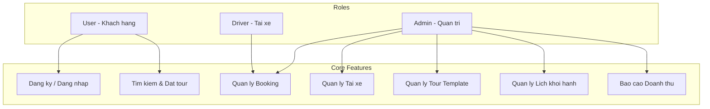

---

## 2. FLOW DANG KY & DANG NHAP (User)

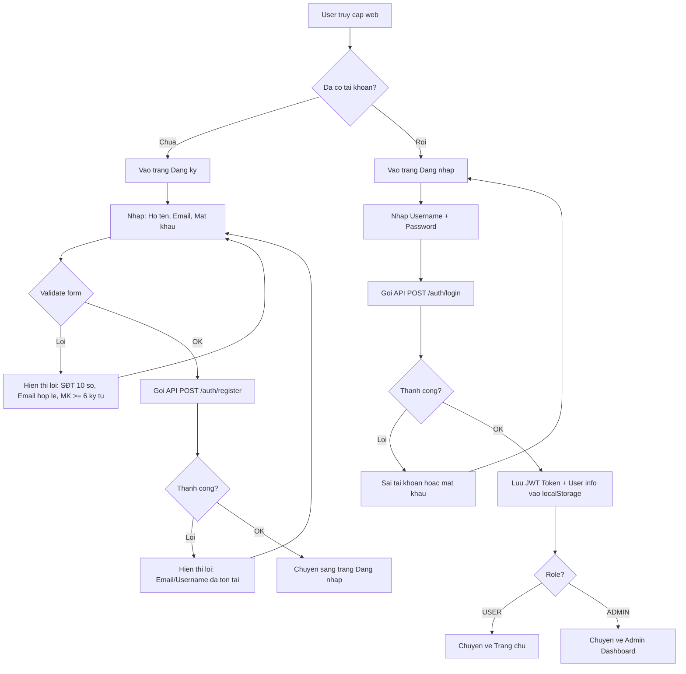

---

## 3. FLOW TIM KIEM & DAT TOUR (User)

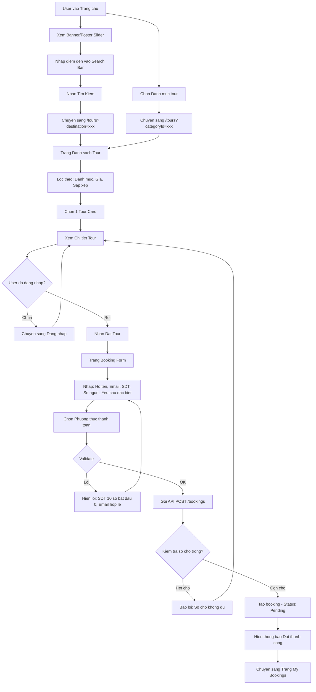

---

## 4. FLOW TRANG THAI BOOKING (Admin)

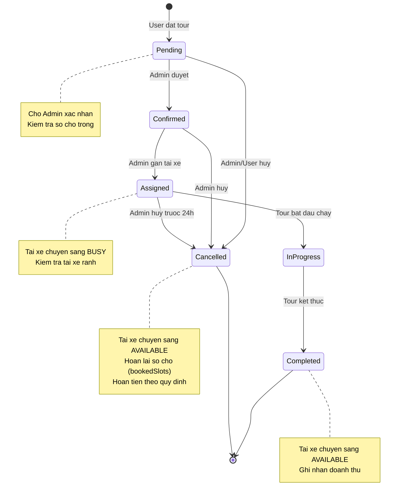

---

## 5. FLOW QUAN LY BOOKING CHI TIET (Admin)

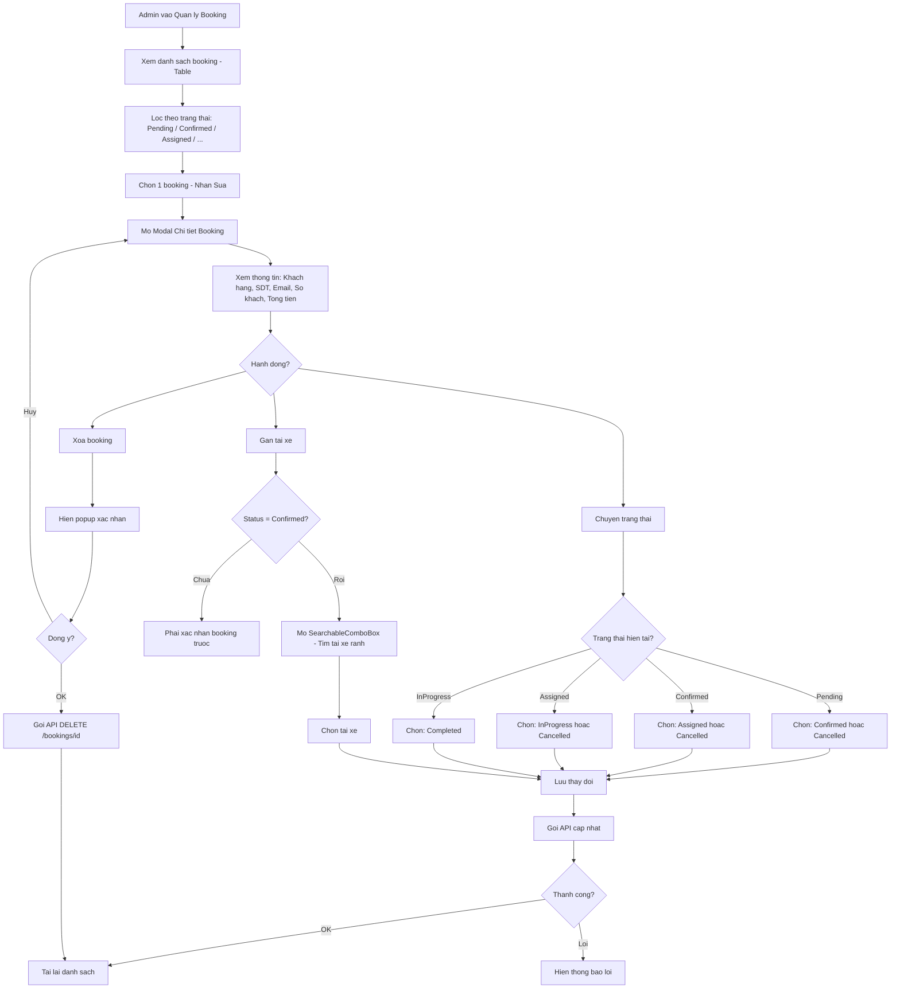

---

## 6. FLOW LOGIC HUY TOUR

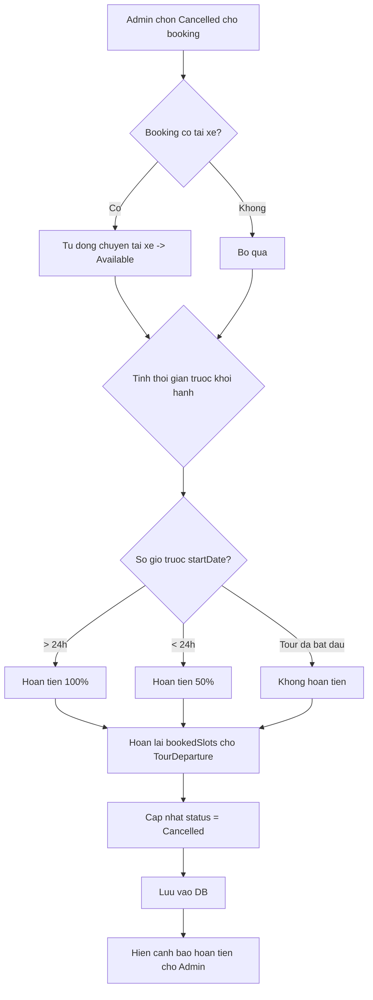

---

## 7. FLOW QUAN LY TAI XE (Admin)

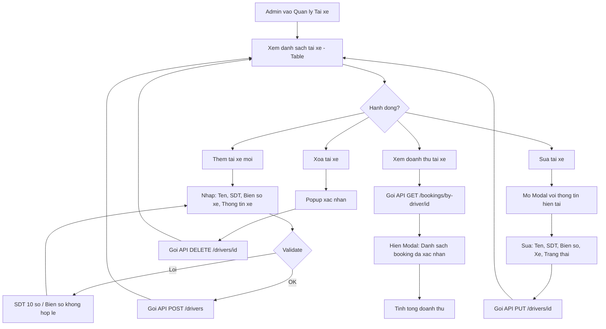

---

## 8. FLOW QUAN LY TOUR (Admin)

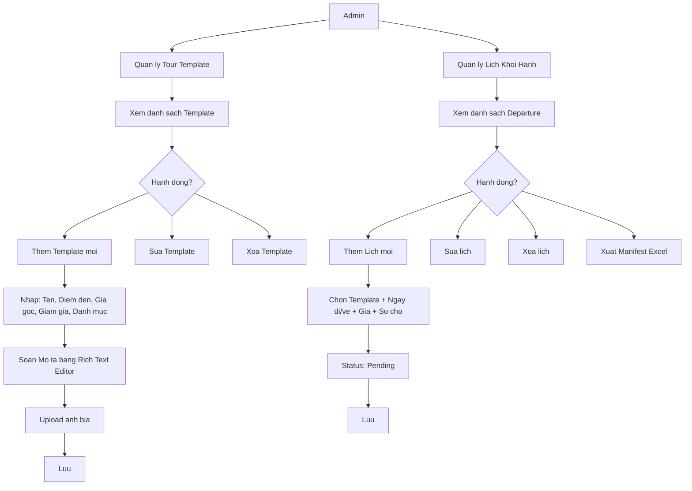

---

## 9. FLOW BAO CAO DOANH THU (Admin)

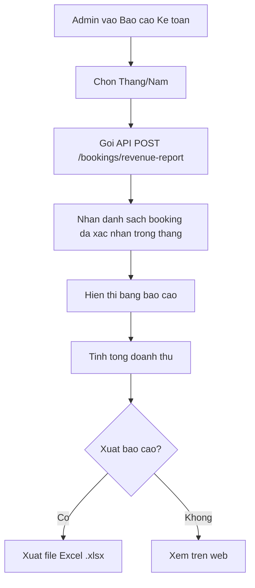

---

## 10. FLOW USER XEM BOOKING CUA TOI

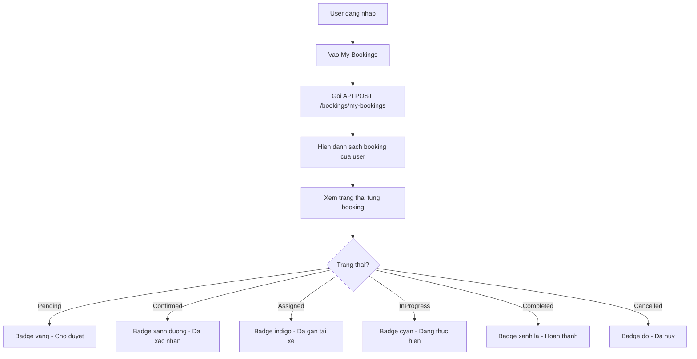

---

## 11. FLOW TOAN BO HE THONG (Overview)

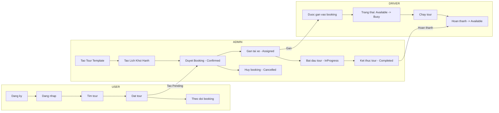

---

## 12. BANG PHAN QUYEN (Authorization Matrix)

| Chuc nang | User | Admin | Driver |
|-----------|------|-------|--------|
| Dang ky / Dang nhap | V | V | - |
| Xem trang chu + Tour | V | V | - |
| Dat tour (Booking) | V | - | - |
| Xem My Bookings | V | - | - |
| Cap nhat Profile | V | V | - |
| Quan ly Tour Template | - | V | - |
| Quan ly Lich Khoi Hanh | - | V | - |
| Duyet / Huy Booking | - | V | - |
| Gan tai xe | - | V | - |
| Quan ly Tai xe | - | V | - |
| Quan ly User | - | V | - |
| Quan ly Danh muc | - | V | - |
| Bao cao Doanh thu | - | V | - |
| Xuat Excel | - | V | - |

---

## 13. BANG TRANG THAI TAI XE

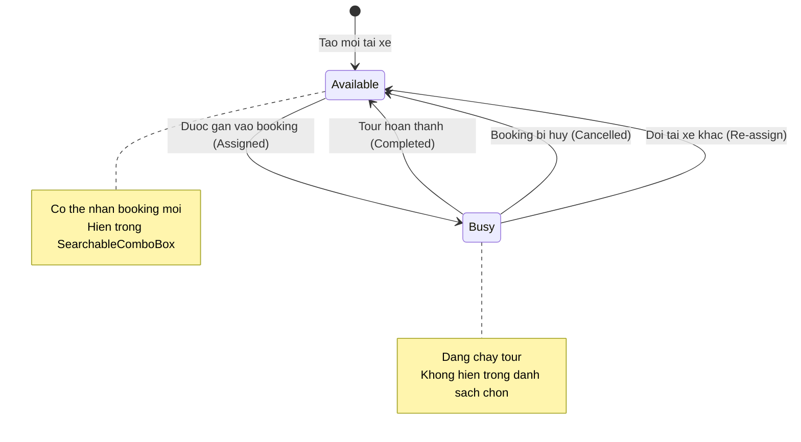
